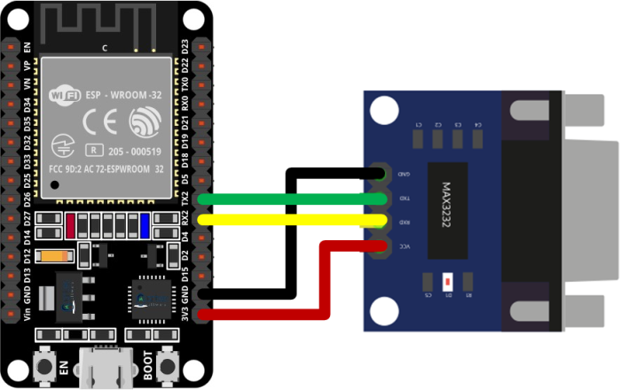

# ESPKyoGate - ESPHome Component for Bentel KYO Alarms

[](https://github.com/sponsors/lorenzo-deluca)
[](https://www.buymeacoffee.com/lorenzodeluca)

A proper [ESPHome external component](https://esphome.io/components/external_components.html) for **Bentel Security KYO alarm panels**, based on ESP32 and communicating over RS-232 serial via a MAX3232 level shifter.

> **Warning**
> This software was developed by analyzing serial messages from/to the panel. It is not sponsored or officially supported by **Bentel**.

## Supported Models

- [x] Bentel KYO 32G
- [x] Bentel KYO 32 / 32M (non-G)
- [x] Bentel KYO 8G
- [x] Bentel KYO 8W
- [x] Bentel KYO 8
- [x] Bentel KYO 4

Model detection is automatic via firmware version query on first connection.

## Features

- **Alarm Control Panel** entities per partition (arm away, arm home, arm night, disarm) with full Home Assistant integration
- **Binary sensors** for zones, zone tamper, zone bypass, alarm memory, tamper memory, warnings, tamper flags, siren, communication status, and output states
- **Text sensors** for firmware version, alarm model, zone diagnostics (type, panel name, partition, ESN), output names, partition timers, and keyfob ESNs
- **Non-blocking serial I/O** with async state machine (no blocking delays)
- **Response caching** with change detection (only publishes when state changes)
- **Exponential backoff** on communication failures (2s to 32s)
- **Dual-query polling** (sensor + partition status every 500ms cycle)
- **One-time config reads** for zone configuration, names, ESNs, output names, partition timers, and keyfob ESNs

## Hardware

### Components

- ESP32 board (e.g., [ESP32 DevKit](https://it.aliexpress.com/item/4001340660273.html))
- [MAX3232 RS-232 to TTL adapter](https://it.aliexpress.com/item/696400942.html) with DB9 connector
- 12V to USB converter for panel-powered operation (recommended for battery backup)

### Wiring

| ESP32 Pin | MAX3232 | KYO Panel |
|-----------|---------|-----------|
| GPIO17 (TX) | TX | RS-232 RX |
| GPIO16 (RX) | RX | RS-232 TX |
| 5V | VCC | - |
| GND | GND | GND |

Power the ESP32 from the panel's +B/AUX 12V output via a 12V-to-USB converter. This ensures the ESP32 stays powered during mains failures (panel battery backup).



## Installation

### As an External Component (recommended)

Add to your ESPHome YAML:

```yaml
external_components:
  - source: github://lorenzo-deluca/espkyogate
    components: [bentel_kyo]
```

### Local Installation

Clone this repository and reference the components directory:

```yaml
external_components:
  - source:
      type: local
      path: path/to/espkyogate/components
    components: [bentel_kyo]
```

## Configuration

### Minimal Example

```yaml
external_components:
  - source: github://lorenzo-deluca/espkyogate
    components: [bentel_kyo]

uart:
  id: uart_bus
  tx_pin: GPIO17
  rx_pin: GPIO16
  baud_rate: 9600
  data_bits: 8
  parity: EVEN

bentel_kyo:
  id: kyo
  uart_id: uart_bus

alarm_control_panel:
  - platform: bentel_kyo
    bentel_kyo_id: kyo
    name: "House"
    partition: 1
```

### Full Example

```yaml
external_components:
  - source: github://lorenzo-deluca/espkyogate
    components: [bentel_kyo]

esp32:
  board: lolin32
  framework:
    type: esp-idf

uart:
  id: uart_bus
  tx_pin: GPIO17
  rx_pin: GPIO16
  baud_rate: 9600
  data_bits: 8
  parity: EVEN

bentel_kyo:
  id: kyo
  uart_id: uart_bus

# Alarm Control Panel — one per partition (up to 8)
# Maps to Home Assistant alarm_control_panel entities with arm/disarm controls

alarm_control_panel:
  - platform: bentel_kyo
    bentel_kyo_id: kyo
    name: "Ground Floor"
    partition: 1
    entry_delay:
      name: "Ground Floor Entry Delay"
    exit_delay:
      name: "Ground Floor Exit Delay"
    siren_timer:
      name: "Ground Floor Siren Timer"

  - platform: bentel_kyo
    bentel_kyo_id: kyo
    name: "First Floor"
    partition: 2

  - platform: bentel_kyo
    bentel_kyo_id: kyo
    name: "Basement"
    partition: 3

# Binary Sensors — zones, warnings, tamper, siren, outputs

binary_sensor:
  - platform: bentel_kyo
    bentel_kyo_id: kyo

    # Zones (1-32) — zone status with optional diagnostic text sensors
    zones:
      - zone: 1
        name: "Front Door"
        device_class: door
        zone_type:
          name: "Front Door Zone Type"
        panel_name:
          name: "Front Door Panel Name"
        zone_partition:
          name: "Front Door Partition"
        esn:
          name: "Front Door ESN"
      - zone: 2
        name: "Living Room PIR"
        device_class: motion
      - zone: 3
        name: "Kitchen PIR"
        device_class: motion

    # Zone tamper (per-zone tamper detection)
    zone_tamper:
      - zone: 1
        name: "Front Door Tamper"
      - zone: 2
        name: "Living Room Tamper"

    # Zone bypass (per-zone exclusion status)
    zone_bypass:
      - zone: 1
        name: "Front Door Bypassed"

    # Zone alarm memory
    zone_alarm_memory:
      - zone: 1
        name: "Front Door Alarm Memory"

    # Zone tamper memory
    zone_tamper_memory:
      - zone: 1
        name: "Front Door Tamper Memory"

    # Warning flags
    warnings:
      mains_failure:
        name: "Mains Power Failure"
      bpi_missing:
        name: "BPI Module Missing"
      fuse_fault:
        name: "Fuse Fault"
      low_battery:
        name: "Low Battery"
      phone_line_fault:
        name: "Phone Line Fault"
      default_codes:
        name: "Default Codes Warning"
      wireless_fault:
        name: "Wireless Fault"

    # Tamper flags
    tamper:
      tamper_zone:
        name: "Zone Tamper"
      tamper_false_key:
        name: "False Key Tamper"
      tamper_bpi:
        name: "BPI Tamper"
      tamper_system:
        name: "System Tamper"
      tamper_rf_jam:
        name: "RF Jam Detected"
      tamper_wireless:
        name: "Wireless Tamper"

    # Communication status (connectivity to panel)
    communication:
      name: "Panel Communication"

    # Siren status
    siren:
      name: "Siren"

    # OC output states (1-8)
    output_state:
      - output_number: 1
        name: "Output 1"
        panel_name:
          name: "Output 1 Panel Name"
      - output_number: 2
        name: "Output 2"

# Text Sensors — firmware, model, keyfobs

text_sensor:
  - platform: bentel_kyo
    bentel_kyo_id: kyo
    firmware_version:
      name: "Firmware Version"
    alarm_model:
      name: "Alarm Model"
    keyfobs:
      - slot: 1
        name: "Keyfob 1"
      - slot: 2
        name: "Keyfob 2"
```

## Alarm Control Panel

Each `alarm_control_panel` entry creates a proper Home Assistant alarm panel entity for a partition:

| HA Action | KYO Command | Description |
|-----------|-------------|-------------|
| Arm Away | Total arm | Full perimeter + interior protection |
| Arm Home | Partial arm | Perimeter only (interior zones excluded) |
| Arm Night | Partial arm delay 0 | Perimeter with no entry delay |
| Disarm | Disarm | Disarm the partition |

The partition state is read from the panel every 500ms and mapped to:

| Panel State | HA State |
|-------------|----------|
| Armed total | `armed_away` |
| Armed partial | `armed_home` |
| Armed partial delay 0 | `armed_night` |
| Disarmed | `disarmed` |
| Partition alarm | `triggered` |

Optional diagnostic text sensors for each partition:
- `entry_delay` — entry delay timer (seconds)
- `exit_delay` — exit delay timer (seconds)
- `siren_timer` — siren duration timer

## Binary Sensor Reference

### Zones (`zones`)

| Key | Required | Description |
|-----|----------|-------------|
| `zone` | Yes | Zone number (1-32) |
| `name` | Yes | Entity name |
| `device_class` | No | HA device class (motion, door, window, etc.) |
| `zone_type` | No | Text sensor: zone type (Instant, Delayed, Path) |
| `panel_name` | No | Text sensor: zone name configured on the panel |
| `zone_partition` | No | Text sensor: which partition(s) the zone belongs to |
| `esn` | No | Text sensor: wireless sensor ESN |

### Zone Tamper (`zone_tamper`)

Per-zone tamper detection. Uses `device_class: tamper` by default.

### Zone Bypass (`zone_bypass`)

Per-zone exclusion/bypass status.

### Zone Alarm Memory (`zone_alarm_memory`)

Per-zone alarm memory (set after alarm, cleared on reset).

### Zone Tamper Memory (`zone_tamper_memory`)

Per-zone tamper memory.

### Warnings (`warnings`)

| Key | Device Class | Description |
|-----|-------------|-------------|
| `mains_failure` | power | Mains power lost |
| `bpi_missing` | problem | BPI bus module missing |
| `fuse_fault` | problem | Fuse blown |
| `low_battery` | battery | Panel battery low |
| `phone_line_fault` | problem | Telephone line fault |
| `default_codes` | problem | Default codes still active |
| `wireless_fault` | problem | Wireless module fault |

### Tamper Flags (`tamper`)

| Key | Description |
|-----|-------------|
| `tamper_zone` | Zone tamper detected |
| `tamper_false_key` | False key attempt |
| `tamper_bpi` | BPI bus tamper |
| `tamper_system` | System tamper |
| `tamper_rf_jam` | RF jamming detected |
| `tamper_wireless` | Wireless tamper |

### Other Sensors

| Key | Description |
|-----|-------------|
| `communication` | Panel serial communication status |
| `siren` | Siren active status |
| `output_state` | OC output state (1-8), with optional `panel_name` text sensor |

## Text Sensor Reference

| Key | Description |
|-----|-------------|
| `firmware_version` | Panel firmware version string |
| `alarm_model` | Detected alarm model (KYO4, KYO8, KYO32, etc.) |
| `keyfobs` | Keyfob ESN values (slot 1-16) |

## KYO32 vs KYO32G

| Feature | KYO32G | KYO32 (non-G) |
|---------|--------|----------------|
| Output readback | Real state | Always reads 0xFF |
| Max outputs | 8 | 3 |
| Wireless | Yes | Varies by sub-model |

On KYO32 non-G, output state sensors will not reflect the actual output state. Activate/deactivate commands still work correctly.

## Troubleshooting

- Exit the panel's programming mode before connecting (serial port is exclusive)
- Verify TX/RX wiring (try swapping if no response)
- Check MAX3232 module power supply
- Set `logger: level: DEBUG` for detailed serial communication logs
- KYO32G requires firmware **2.13** or later
- If communication drops, the component uses exponential backoff (2s-32s) before retrying

## Community

For discussions and support, visit the [Home Assistant Community forum](https://community.home-assistant.io/t/bentel-kyo32-alarm-system-integration).

## License

GNU AGPLv3 - [Lorenzo De Luca](https://lorenzodeluca.dev), [Rui Marinho](https://github.com/ruimarinho)

Original project by Lorenzo De Luca. Thanks to @dario81 for initial porting to ESPHome and @lcavalli for code refactor inspiration.
